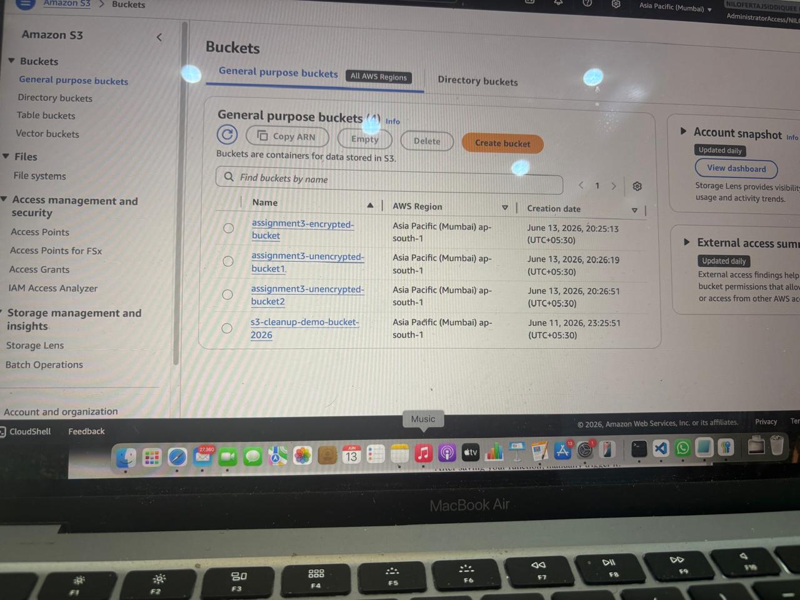
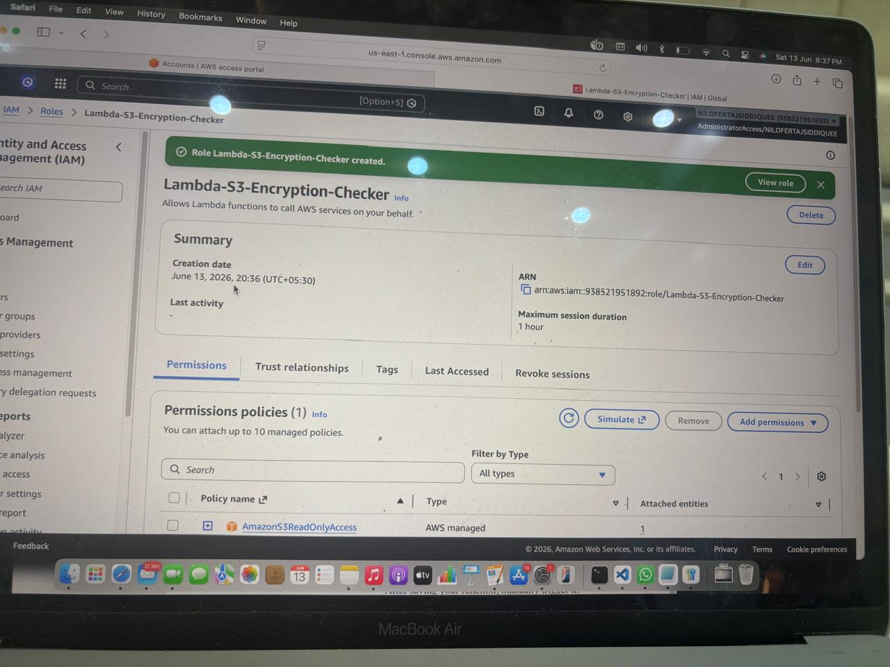
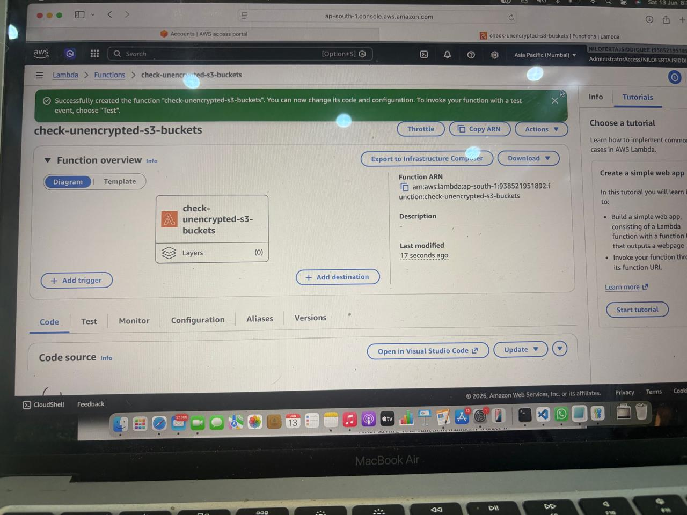

# Assignment 3 - Monitor Unencrypted S3 Buckets

## Objective

Detect S3 buckets that do not have server-side encryption enabled using AWS Lambda and Boto3.

## AWS Services Used

- AWS Lambda
- Amazon S3
- IAM
- CloudWatch
- Boto3

## Steps Performed

1. Created encrypted and unencrypted S3 buckets.
2. Created IAM Role with AmazonS3ReadOnlyAccess.
3. Created Lambda Function.
4. Used Boto3 to inspect bucket encryption.
5. Logged unencrypted buckets.
6. Verified results through CloudWatch.

7. ## Screenshot 1 - S3 Buckets Created

## Screenshot 2 - IAM Role

## Screenshot 3 - Lambda Function

## Screenshot 4 - Lambda Code

## Result

Successfully detected all S3 buckets without server-side encryption enabled.
